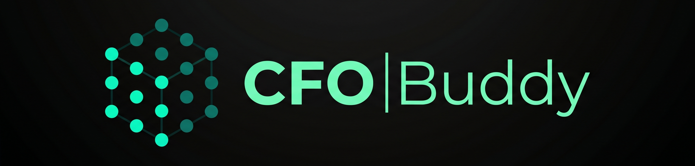
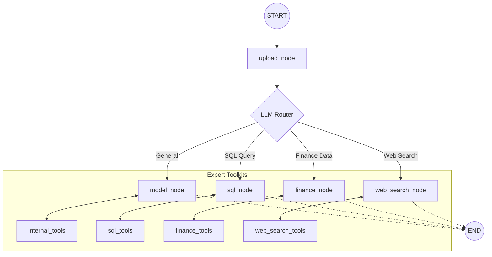
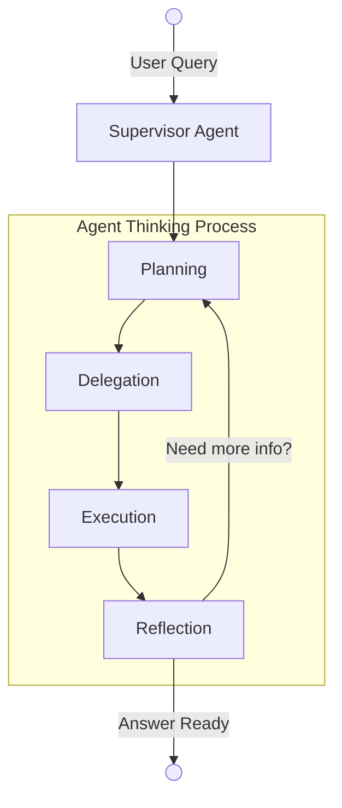
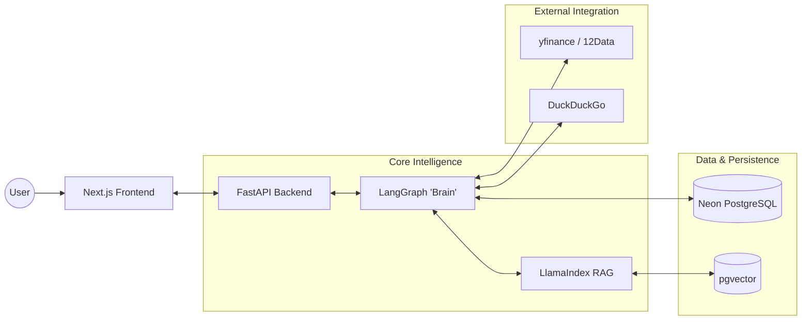

<p align="center">

<br>
<em>An AI-Powered Multi-Agent Orchestration for CFOs - transforming raw financial data into actionable insights through conversational analysis and dynamic charting.</em>
<br><br>
<a title="License MIT" target="_blank" href="https://opensource.org/licenses/MIT"></a>
<a title="Python" target="_blank" href="https://www.python.org/"></a>
<a title="Next.js" target="_blank" href="https://nextjs.org/"></a>
</p>

---

## Table of Contents

* [Introduction](#introduction)
* [Core Features](#core-features)
* [Graph Structure](#graph-structure)
* [Agent Workflow](#agent-workflow)
* [System Architecture](#system-architecture)
* [Tech Stack](#tech-stack)
* [Quick Start](#quick-start)

---

## Introduction

CFO Buddy is a **next-generation financial intelligence assistant** that blends the power of LLMs with real-time data, multi-agent reasoning, and a sleek ChatGPT-style interface.

Upload your data. Ask questions. Get insights.  
Simple on the surface — **deeply intelligent underneath.**

---

## Core Features

- **Conversational Finance** — Ask anything, get expert-level insights  
- **Multi-File Intelligence** — CSV, PDF, Excel, Word support  
- **Auto Charts** — Plotly-powered visualizations generated on the fly  
- **Agentic Reasoning** — Transparent thinking + decision flow  
- **Memory System** — Resume conversations anytime  
- **Hybrid Retrieval Engine** — Semantic + keyword search fusion  
- **Live Financial Data** — Powered by yfinance + APIs  

---


 
## Graph Structure

The "brain" of CFO Buddy is a multi-agent state machine built with **LangGraph**. It uses a specialized router to delegate queries to expert agents, each equipped with its own suite of professional tools.

---


## Agent Workflow

The "brain" of CFO Buddy is a multi-agent orchestration layer. A **Supervisor** node manages a team of specialized experts, deciding who to delegate tasks to and verifying results before responding.


---


## System Architecture

CFO Buddy is built with a modern, high-performance stack designed for scalability and intelligence. It separates the presentation layer, the orchestration "brain," and the data/external tool layers.

---


## Tech Stack

| Component | Technology |
|-----------|------------|
| **LLM** | Groq (Llama 3 / Mixtral) |
| **Orchestration** | LangGraph |
| **Vector DB** | Neon (PostgreSQL + pgvector) |
| **Framework** | FastAPI (Backend) / Next.js (Frontend) |
| **Search** | LlamaIndex + BM25 |
| **Charts** | Plotly + HTML Components |

---

## Quick Start

### 1. Backend Setup
```bash
git clone https://github.com/caffeicsatyam/cfobuddy.git
cd cfobuddy
python -m venv venv
source venv/bin/activate  # venv\Scripts\activate on Windows
pip install -r requirements.txt
```

### 2. Environment Variables
Create a `.env` in the root:
```env
GROQ_API_KEY=your_key
DATABASE_URL=your_neon_url
TWELVE_DATA_API_KEY=your_key
```

### 3. Build & Run
```bash
python build_index.py  # Initialize vector store
python api/main.py     # Start API
```

### 4. Frontend Setup
```bash
cd frontend
npm install
npm run dev
```
