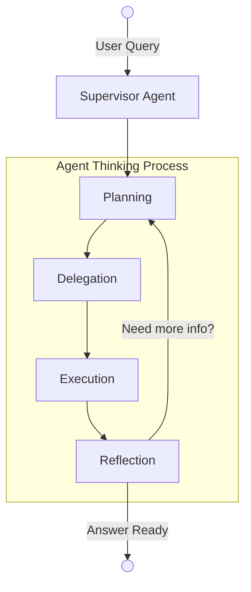
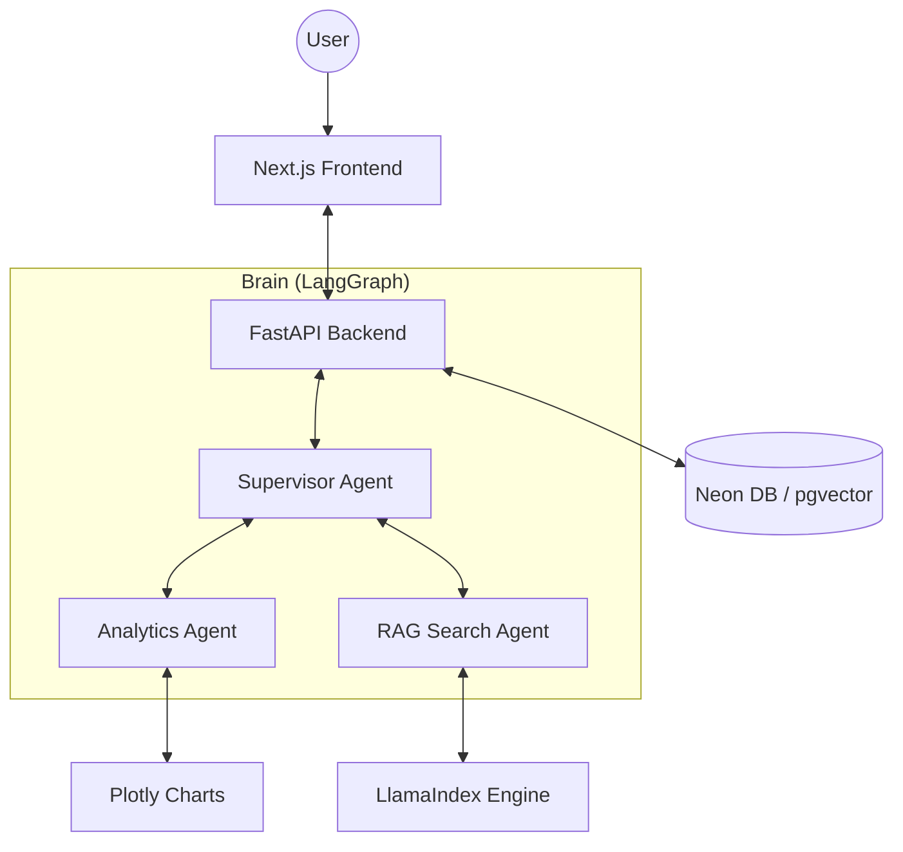

# 🚀 CFO Buddy — Your AI-Powered Financial Co-Pilot

> Not just another dashboard. Not just another chatbot.  
> **CFO Buddy thinks, analyzes, and advises like a real financial expert.**

---

## 💼 What is CFO Buddy?

CFO Buddy is a **next-generation financial intelligence assistant** that blends the power of LLMs with real-time data, multi-agent reasoning, and a sleek ChatGPT-style interface.

Upload your data. Ask questions. Get insights.  
Simple on the surface — **deeply intelligent underneath.**

---

## ✨ Core Features

- 💬 **Conversational Finance** — Ask anything, get expert-level insights  
- 📁 **Multi-File Intelligence** — CSV, PDF, Excel, Word support  
- 📈 **Auto Charts** — Plotly-powered visualizations generated on the fly  
- 🧠 **Agentic Reasoning** — Transparent thinking + decision flow  
- 🗄️ **Memory System** — Resume conversations anytime  
- 🔍 **Hybrid Retrieval Engine** — Semantic + keyword search fusion  
- 🌐 **Live Financial Data** — Powered by yfinance + APIs  

---

## 🧠 Agent Workflow

The "brain" of CFO Buddy is a multi-agent orchestration layer. A **Supervisor** node manages a team of specialized experts, deciding who to delegate tasks to and verifying results before responding.


---


    
## 🏗️ System Architecture

CFO Buddy is built with a modern, high-performance stack designed for scalability and intelligence.


---


## 🛠️ Tech Stack

| Component | Technology |
|-----------|------------|
| **LLM** | Groq (Llama 3 / Mixtral) |
| **Orchestration** | LangGraph |
| **Vector DB** | Neon (PostgreSQL + pgvector) |
| **Framework** | FastAPI (Backend) / Next.js (Frontend) |
| **Search** | LlamaIndex + BM25 |
| **Charts** | Plotly + HTML Components |

---

## 🚀 Quick Start

### 1. Backend Setup
```bash
git clone https://github.com/caffeicsatyam/cfobuddy.git
cd cfobuddy
python -m venv venv
source venv/bin/activate  # venv\Scripts\activate on Windows
pip install -r requirements.txt
```

### 2. Environment Variables
Create a `.env` in the root:
```env
GROQ_API_KEY=your_key
DATABASE_URL=your_neon_url
TWELVE_DATA_API_KEY=your_key
```

### 3. Build & Run
```bash
python build_index.py  # Initialize vector store
python api/main.py     # Start API
```

### 4. Frontend Setup
```bash
cd frontend
npm install
npm run dev
```
